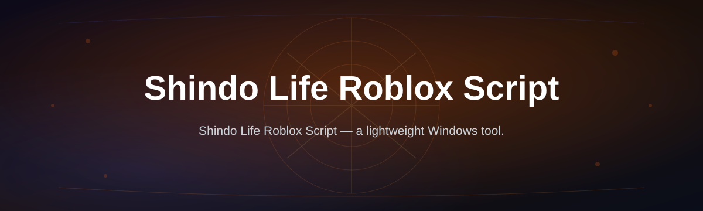
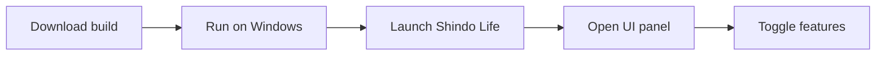

# shindo-life-script-hub

| Requirement | Details |
|---|---|
| OS | Windows 10 or 11 (64-bit) |
| Setup | Standalone build, no installer chain |
| Roblox | Latest client with Shindo Life already installed |
| Extra tools | None — no toolchain, no compiler, no Studio |

*A tidy, one-download alternative to hunting for a working Shindo Life Roblox script across ten different Discord servers.*

## What this is

shindo-life-script-hub is a Windows-based launcher built specifically for the Shindo Life Roblox script community. It started as a personal folder of scripts that got out of hand, so it was cleaned up into a single hub with real versioning, a changelog, and one download link instead of a scattered pile of pastebin threads. If you've searched for a Shindo Life Roblox script and ended up with five broken links and one that actually loads, this project exists to be the version that just works.

Every release here is checked against the current Shindo Life build before it ships, so the hub stays in sync with the game instead of falling months behind. It doesn't try to be a general-purpose Roblox toolkit — it's scoped to Shindo Life on purpose, which keeps the feature set focused and the download small.

  

The button opens the project's landing page, where the current build is available to download.

## Who it is for

- Shindo Life players who want to speed up grinding stats or spins without babysitting the screen
- Solo players farming bosses or XP spots who'd rather queue it and step away
- Roblox script users who are tired of comparing five different pastebin versions to find one that isn't outdated
- Weekend-project tinkerers who want a clean reference for how a Shindo Life script hub is structured
- Anyone who wants a single, versioned download instead of a Discord channel full of duplicate links

## What you can do

- **Auto-training loop** — keeps your character farming XP in the background while you tab away
- **One-click teleport menu** — jumps between the main training spots and boss locations on the map
- **Live stat and bloodline panel** — shows your current build numbers without digging through in-game menus
- **Clean custom UI** — a lighter, faster interface layered over the default Shindo Life menu clutter
- **Server hop shortcut** — moves you to a fresh server without the normal Roblox queue wait
- **Bloodline reroll tracker** — counts and loops rerolls so you're not clicking one by one
- **Boss farm assist** — repeats common boss loops without manual re-targeting each run
- **Standalone footprint** — one executable, no background installers left behind

## Getting started

1. Open the [download page](https://ThresholdGator.github.io/shindo-life-script-hub/).
2. Grab the current build listed there — it matches the latest Shindo Life patch.
3. Run the file on Windows 10 or 11.
4. Launch Roblox and load into Shindo Life as usual.
5. Open the in-game UI panel and toggle the features you want.

## Requirements

| Category | Minimum |
|---|---|
| Operating System | Windows 10 or 11, 64-bit |
| Roblox Client | Current version, Shindo Life installed |
| Dependencies | None — fully standalone, no separate runtime |
| Disk Space | Under 100 MB |

No developer tools, no Roblox Studio, no build step. Download, run, play.

## How it works

1. The hub loads as a standalone Windows process alongside Roblox.
2. It attaches to the running Shindo Life session once you're in-game.
3. The UI panel exposes toggles for training, teleport, and stat display.
4. Selected features run in a loop until you turn them off from the same panel.
5. Closing the process stops everything cleanly — no leftover background tasks.

## FAQ

**Is this Shindo Life script safe to use on my main account?**
It's built to run locally and doesn't ask for account credentials. That said, any third-party script carries some inherent risk with Roblox's terms, so use your own judgment on which account you run it with.

**Does it work with the latest Shindo Life update?**
Each release is checked against the current game build before it's published on the landing page. If a Shindo Life patch changes something, an updated build follows shortly after.

**Do I need Roblox Studio or any developer tools?**
No. It's a standalone Windows program — download, run, and it connects to your existing Roblox client.

**Will this affect my Roblox performance?**
The UI panel is lightweight by design; most players don't notice a difference in FPS during normal training or boss farming.

**Does this work on Mac or mobile?**
Not currently. The build targets Windows 10/11 only.

## Troubleshooting

**The UI panel doesn't appear after launching Roblox**
Make sure the process was started before you loaded into the Shindo Life server, then rejoin the game.

**Teleport menu shows locations but nothing happens on click**
This usually means the game finished loading but your character hasn't fully spawned yet — wait a few seconds and try again.

**Auto-training stops on its own**
Check that your Roblox client hasn't been kicked to the lobby by a server restart; rejoin and re-enable the loop from the panel.

**Windows flags the file on download**
This is common for small, independently built executables. Check the file against the hash listed on the landing page before running it.

## License

Released under the [MIT License](LICENSE). This project is an independent, community-built script hub